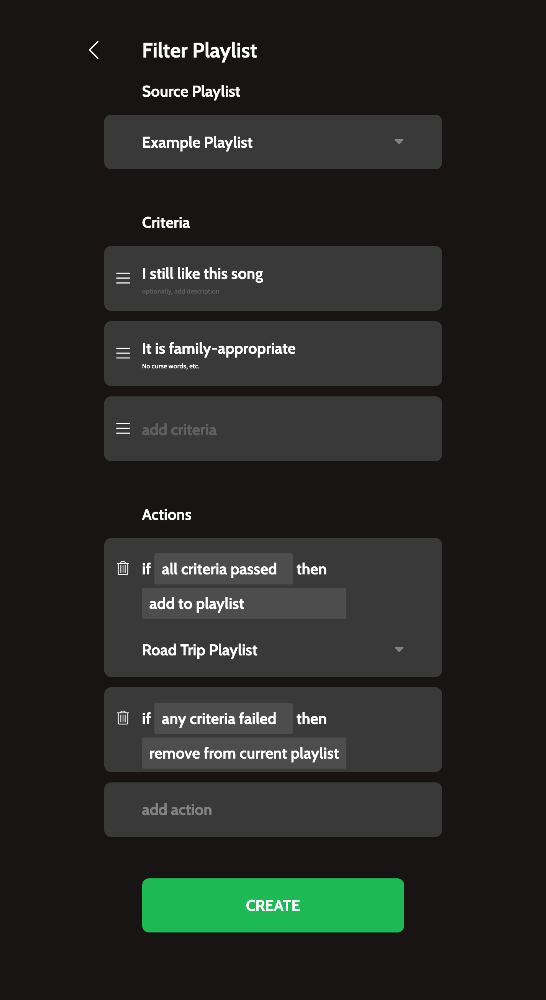
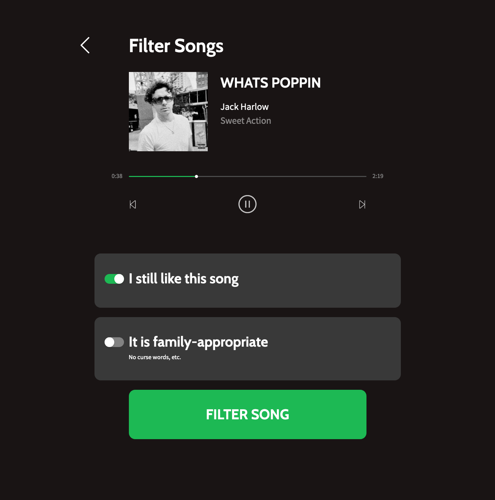

# Filter Playlist

> A tool that helps you vet your Spotify playlists based on qualitative, self-defined criteria.

Try it out on [filter-playlist.web.app](https://filter-playlist.web.app)

## What is Filter Playlist?

1. **Select** the Spotify playlist you want to filter
2. **Define** criteria that you will rate for each song
3. **Set** actions that happen when specific criteria pass or fail
4. **Mark** which criteria pass or fail for each song

The app will automatically invoke actions based on how you judge each song, such as adding to another playlist or removing from the current playlist.

## Screenshots

**Step 1** — Select a playlist to filter, define criteria, and set actions.

**Step 2** — The app will queue all the songs on your playlist. For each song, check all the criteria that you consider pass and click "Filter Song."

The app will automatically invoke the actions you set, based on how you flag each song.

## Disclaimer

I created this project for a few (large) playlists that I needed to filter. Basic functionality exists, but not everything is polished! Use at your own discretion and PRs welcome!
